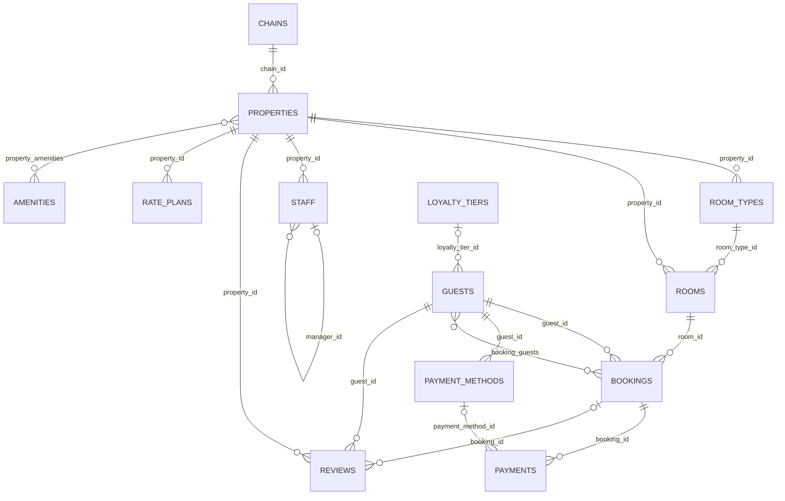

# Database reference

Every example in this section queries the same schema: a small hotel-booking database, deep
enough in relationships to show what joins, aggregates, and nested writes actually look like
against something more real than a couple of flat tables. It ships as this repo's own dev
fixture — see [Launch it yourself](launch-it-yourself.md) to bring it up locally.

An arrow into a table is the direction rel calls **incoming** when you join that way — the
child's own foreign key points back at the parent (`rooms.property_id → properties.id`), so it
comes back as an array. Reading a foreign key the other way — `properties.chain_id →
chains.id` — is **outgoing**: one object, not an array. See [Joining and embedding
relations](../query-language/joining.md) for what that means for a query.

## Tables

| Table | Key | What it is |
|---|---|---|
| [`hotel.chains`](tables/chains.md) | `id` | A hotel group operating one or more properties under a shared brand. |
| [`hotel.properties`](tables/properties.md) | `id` | A single hotel property belonging to a chain. |
| [`hotel.room_types`](tables/room_types.md) | `id` | A category of room offered by a property (e.g. Deluxe, Suite), with its own base price and capacity. |
| [`hotel.rooms`](tables/rooms.md) | `id` | A single physical room within a property. |
| [`hotel.staff`](tables/staff.md) | `id` | Property staff; `manager_id` self-references another row in `hotel.staff`. |
| [`hotel.amenities`](tables/amenities.md) | `id` | A catalog of amenities a property can offer (pool, gym, parking, ...). |
| [`hotel.property_amenities`](tables/property_amenities.md) | `(property_id, amenity_id)` | Many-to-many: which amenities a property offers. |
| [`hotel.loyalty_tiers`](tables/loyalty_tiers.md) | `id` | Loyalty program tiers, looked up by name. |
| [`hotel.guests`](tables/guests.md) | `id` | A person who can book a room. |
| [`hotel.bookings`](tables/bookings.md) | `id` (uuid) | A guest's reservation of a room for a period (`stay`, a `tstzrange`). |
| [`hotel.booking_guests`](tables/booking_guests.md) | `(booking_id, guest_id)` | Many-to-many: every guest actually staying on a booking, beyond just the primary booker. |
| [`hotel.payment_methods`](tables/payment_methods.md) | `id` | A guest's saved payment method — a non-reversible summary only (brand/last4/expiry), never a full card number. |
| [`hotel.payments`](tables/payments.md) | `id` (uuid) | A charge (or refund) against a booking. |
| [`hotel.reviews`](tables/reviews.md) | `id` | A guest's review of a property, optionally tied to the specific booking it followed. |
| [`hotel.rate_plans`](tables/rate_plans.md) | `id` | A property's named rate/cancellation policy. |

Each table above has its own page with its column list, its own slice of the diagram above, and
what makes it worth looking at in this fixture specifically.

A few columns worth knowing about because they show up in examples across this section:
`hotel.guests.billing_address` and `hotel.payment_methods.card` are composite-typed columns
(`hotel.address`, `hotel.card_summary`), not joins to another table — a guest only ever has one
current billing address. `hotel.rooms.features` is a plain `text[]`. `hotel.properties` and
`hotel.reviews` each carry a generated `tsvector` column for full-text search. Several tables
also expose [computed fields](../query-language/computed-fields.md) —
`hotel.booking_nights(booking)`, `hotel.booking_total_paid(booking)`,
`hotel.guest_full_name(guest)`, `hotel.property_average_rating(property)` — ordinary Postgres
functions taking the row type as their argument, selectable by bare name (`"booking_nights"`)
exactly like a real column.
