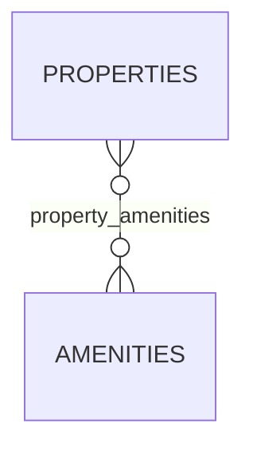

# hotel.amenities

A catalog of amenities a property can offer (pool, gym, parking, ...), linked to properties
many-to-many through `hotel.property_amenities`.

## Columns

| Column | Type | Notes |
|---|---|---|
| `id` | `bigint` | Primary key, identity. |
| `name` | `text` | Not null, unique. |
