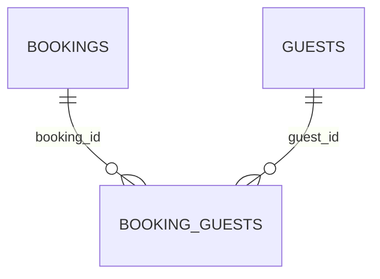

# hotel.booking_guests

The many-to-many join table between bookings and guests: every guest actually staying on a
booking, beyond just the primary booker already named on `hotel.bookings.guest_id`.

## Columns

| Column | Type | Notes |
|---|---|---|
| `booking_id` | `uuid` | Not null, references `hotel.bookings (id)`. Part of the primary key. |
| `guest_id` | `bigint` | Not null, references `hotel.guests (id)`. Part of the primary key. |
