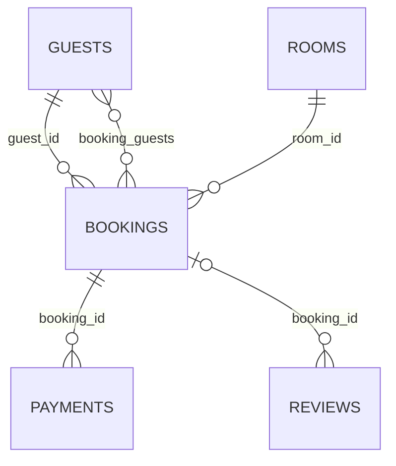

# hotel.bookings

A guest's reservation of a room for a period. UUID-keyed, unlike most other tables in this
schema — bookings are the kind of entity a real system would expose externally by id. `stay`
is a `tstzrange`, and an `EXCLUDE USING gist (room_id WITH =, stay WITH &&)` constraint stops two
bookings from claiming the same room over overlapping periods (needs the `btree_gist`
extension, enabled for this schema, for `=` on a plain `bigint` to be usable inside a GiST
exclusion constraint at all). The seed data respects this by construction — it tracks each
room's already-assigned ranges itself rather than retrying on a constraint violation — so no two
seeded bookings for the same room ever overlap.

## Columns

| Column | Type | Notes |
|---|---|---|
| `id` | `uuid` | Primary key, defaults to `gen_random_uuid()`. |
| `guest_id` | `bigint` | Not null, references `hotel.guests (id)` — the primary booker. |
| `room_id` | `bigint` | Not null, references `hotel.rooms (id)`. |
| `stay` | `tstzrange` | Not null. |
| `status` | `hotel.booking_status` (enum) | Not null, defaults to `'confirmed'`. One of `confirmed`/`cancelled`/`checked_in`/`checked_out`. |
| `created_at` | `timestamptz` | Not null, defaults to `now()`. |

## Notable functions

- `hotel.booking_nights(booking)` — [computed field](../../query-language/computed-fields.md),
  length of `stay` in nights; a pure function of the row's own columns.
- `hotel.booking_total_paid(booking)` — [computed field](../../query-language/computed-fields.md),
  sum of this booking's completed [payments](payments.md); reads another table, so it's `STABLE`
  rather than `IMMUTABLE` like `booking_nights`.
- `hotel.booking_stats(property_id)` — `RETURNS TABLE(total_bookings, total_revenue,
  avg_nights)`, aggregated across a property's bookings; test-purpose, exercising a
  `record`-typed return with `OUT`-mode pseudo-arguments rather than a named composite type.
