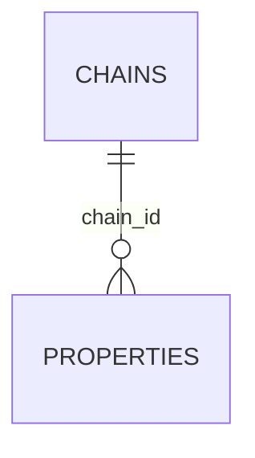

# hotel.chains

A hotel group operating one or more properties under a shared brand. The simplest table in the
schema — a plain lookup with nothing but a name, included as the top of the ownership hierarchy
(`chains` → `properties` → `rooms`) every join/nested-write example builds on.

## Columns

| Column | Type | Notes |
|---|---|---|
| `id` | `bigint` | Primary key, identity. |
| `name` | `text` | Not null, unique. |
