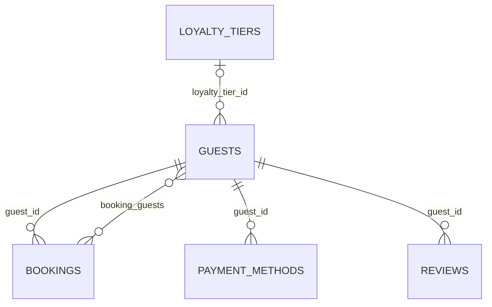

# hotel.guests

A person who can book a room. `billing_address` is a composite-typed column
(`hotel.address` — street/city/region/postal_code/country), not a join to a separate table: a
guest only ever has one current billing address. The seed data includes one guest with no
bookings at all (`never.booked@example.test`), a named row worth referencing directly when a
query needs to show an empty-relation case.

## Columns

| Column | Type | Notes |
|---|---|---|
| `id` | `bigint` | Primary key, identity. |
| `email` | `text` | Not null, unique. |
| `first_name` | `text` | Not null. |
| `last_name` | `text` | Not null. |
| `phone` | `text` | Nullable. |
| `date_of_birth` | `date` | Nullable. |
| `billing_address` | `hotel.address` (composite) | Nullable. |
| `loyalty_tier_id` | `bigint` | Nullable, references `hotel.loyalty_tiers (id)`. |
| `created_at` | `timestamptz` | Not null, defaults to `now()`. |

## Notable functions

- `hotel.guest_full_name(guest)` — [computed field](../../query-language/computed-fields.md),
  `first_name || ' ' || last_name`; the simplest possible case, a pure function of the row's own
  columns.
- `hotel.split_name(full_name, out first_name, out last_name)` — test-purpose only, exercising
  `OUT`-mode argument introspection; not tied to `hotel.guests`' own data.
