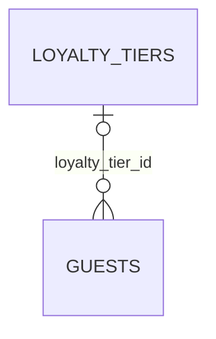

# hotel.loyalty_tiers

Loyalty program tiers, looked up by name — deliberately a lookup table rather than an enum,
unlike `hotel.room_status`/`booking_status`/`payment_status` elsewhere in this schema. A guest's
tier is optional (`hotel.guests.loyalty_tier_id` is nullable).

## Columns

| Column | Type | Notes |
|---|---|---|
| `id` | `bigint` | Primary key, identity. |
| `name` | `text` | Not null, unique. |
| `min_points` | `integer` | Not null, defaults to `0`. |
