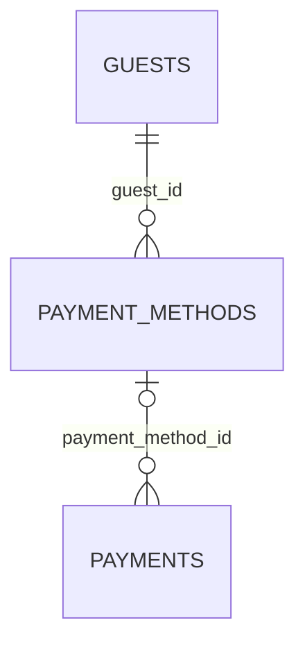

# hotel.payment_methods

A guest's saved payment method. `card` is a composite-typed column (`hotel.card_summary` —
brand/last4/expiry_month/expiry_year) and only ever stores a non-reversible summary, never a
full card number, even in test fixtures.

## Columns

| Column | Type | Notes |
|---|---|---|
| `id` | `bigint` | Primary key, identity. |
| `guest_id` | `bigint` | Not null, references `hotel.guests (id)`. |
| `card` | `hotel.card_summary` (composite) | Not null. |
| `is_default` | `boolean` | Not null, defaults to `false`. |
