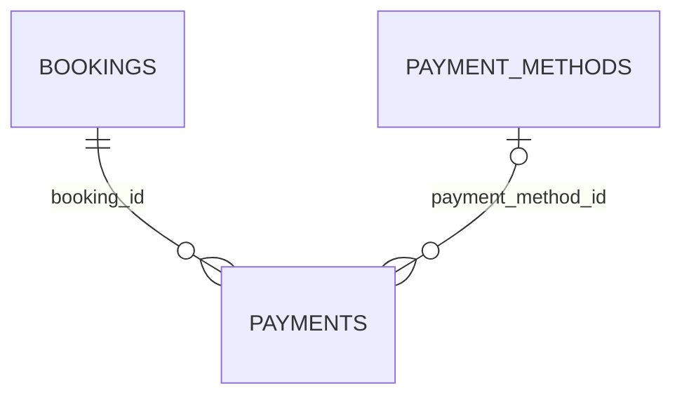

# hotel.payments

A charge (or refund) against a booking. UUID-keyed, like `hotel.bookings`. `payment_method_id`
is nullable — a payment doesn't have to be tied back to one of the guest's saved methods.

## Columns

| Column | Type | Notes |
|---|---|---|
| `id` | `uuid` | Primary key, defaults to `gen_random_uuid()`. |
| `booking_id` | `uuid` | Not null, references `hotel.bookings (id)`. |
| `payment_method_id` | `bigint` | Nullable, references `hotel.payment_methods (id)`. |
| `amount` | `numeric(10, 2)` | Not null. |
| `currency` | `char(3)` | Not null, defaults to `'USD'`. |
| `status` | `hotel.payment_status` (enum) | Not null, defaults to `'pending'`. One of `pending`/`completed`/`refunded`/`failed`. |
| `paid_at` | `timestamptz` | Nullable. |
