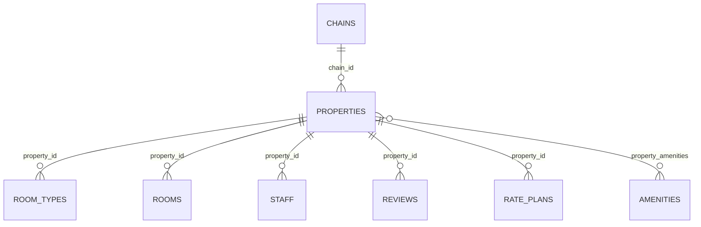

# hotel.properties

A single hotel property belonging to a chain — the table most join/aggregate examples in this
documentation are rooted at. `description_search` is a stored, generated `tsvector` column
(`to_tsvector('english', description)`), GIN-indexed, and backs `hotel.search_properties(query)`
— a `SETOF hotel.properties` function, joinable/selectable as its own relation rather than a
computed column (see [Calling functions](../../query-language/functions.md)). `location` is a
plain Postgres `point`.

## Columns

| Column | Type | Notes |
|---|---|---|
| `id` | `bigint` | Primary key, identity. |
| `chain_id` | `bigint` | References `hotel.chains (id)`, nullable. |
| `name` | `text` | Not null. |
| `location` | `point` | Nullable. |
| `star_rating` | `smallint` | Nullable, checked between 1 and 5. |
| `description` | `text` | Nullable. |
| `description_search` | `tsvector` | Generated (stored) from `description`, GIN-indexed. |
| `created_at` | `timestamptz` | Not null, defaults to `now()`. |

## Notable functions

- `hotel.search_properties(query text)` — `SETOF hotel.properties`, a function-relation over
  `description_search`. See [Calling functions](../../query-language/functions.md).
- `hotel.property_average_rating(property)` — [computed field](../../query-language/computed-fields.md),
  average of `hotel.reviews.rating` for this property.
