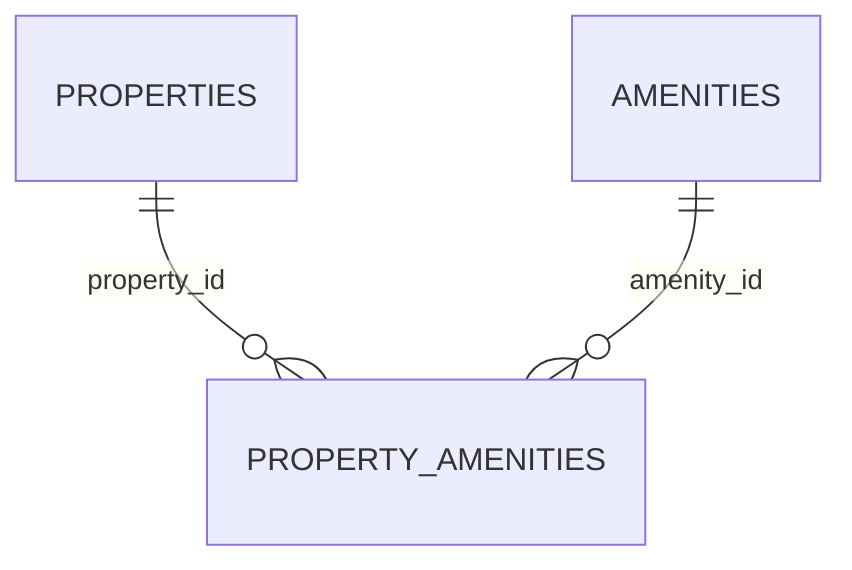

# hotel.property_amenities

The many-to-many join table between properties and amenities: which amenities a property
offers. Deliberately parallel to `hotel.rooms.features` (a plain `text[]`) — the same kind of
fact ("what does this thing offer") modeled two different ways in the same schema, one as a
join table and one as an array column.

## Columns

| Column | Type | Notes |
|---|---|---|
| `property_id` | `bigint` | Not null, references `hotel.properties (id)`. Part of the primary key. |
| `amenity_id` | `bigint` | Not null, references `hotel.amenities (id)`. Part of the primary key. |
