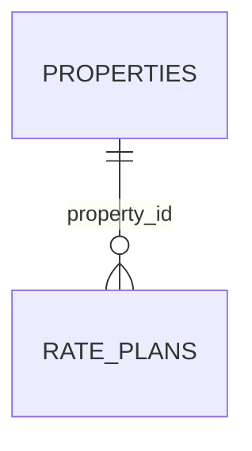

# hotel.rate_plans

A property's named rate/cancellation policy. `cancellation_window` is the one `interval`-typed
column anywhere in this schema.

## Columns

| Column | Type | Notes |
|---|---|---|
| `id` | `bigint` | Primary key, identity. |
| `property_id` | `bigint` | Not null, references `hotel.properties (id)`. |
| `name` | `text` | Not null. Unique together with `property_id`. |
| `refundable` | `boolean` | Not null, defaults to `true`. |
| `cancellation_window` | `interval` | Not null, defaults to `'24 hours'`. |
