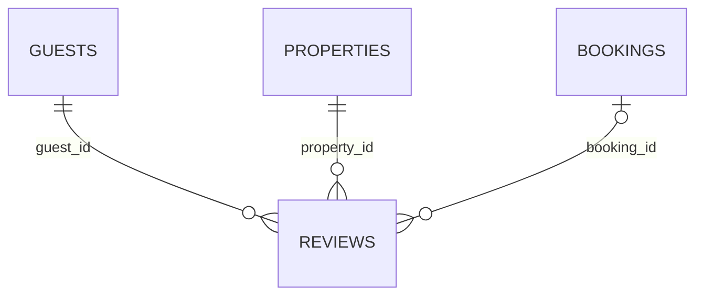

# hotel.reviews

A guest's review of a property, optionally tied to the specific booking it followed. Carries a
second, independent full-text-search column from `hotel.properties.description_search` —
`comment_search`, a stored generated `tsvector` over `comment`, GIN-indexed the same way. The
seed data includes one property with no reviews at all ("The Unreviewed Inn"), a named row worth
referencing directly when a query needs to show an empty-relation case.

## Columns

| Column | Type | Notes |
|---|---|---|
| `id` | `bigint` | Primary key, identity. |
| `guest_id` | `bigint` | Not null, references `hotel.guests (id)`. |
| `property_id` | `bigint` | Not null, references `hotel.properties (id)`. |
| `booking_id` | `uuid` | Nullable, references `hotel.bookings (id)`. |
| `rating` | `smallint` | Not null, checked between 1 and 5. |
| `comment` | `text` | Nullable. |
| `comment_search` | `tsvector` | Generated (stored) from `comment`, GIN-indexed. |
| `created_at` | `timestamptz` | Not null, defaults to `now()`. |
