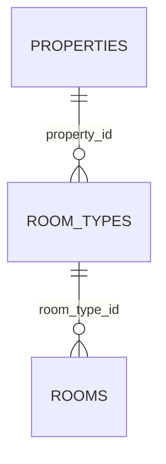

# hotel.room_types

A category of room offered by a property (e.g. Deluxe, Suite), with its own base price and
capacity. Sits between `properties` and `rooms` — a room's nightly rate is looked up through its
room type, not stored on the room itself (see `hotel.room_effective_rate` below).

## Columns

| Column | Type | Notes |
|---|---|---|
| `id` | `bigint` | Primary key, identity. |
| `property_id` | `bigint` | Not null, references `hotel.properties (id)`. |
| `name` | `text` | Not null. Unique together with `property_id`. |
| `base_price` | `numeric(10, 2)` | Not null. |
| `capacity` | `smallint` | Not null, defaults to `2`. |
