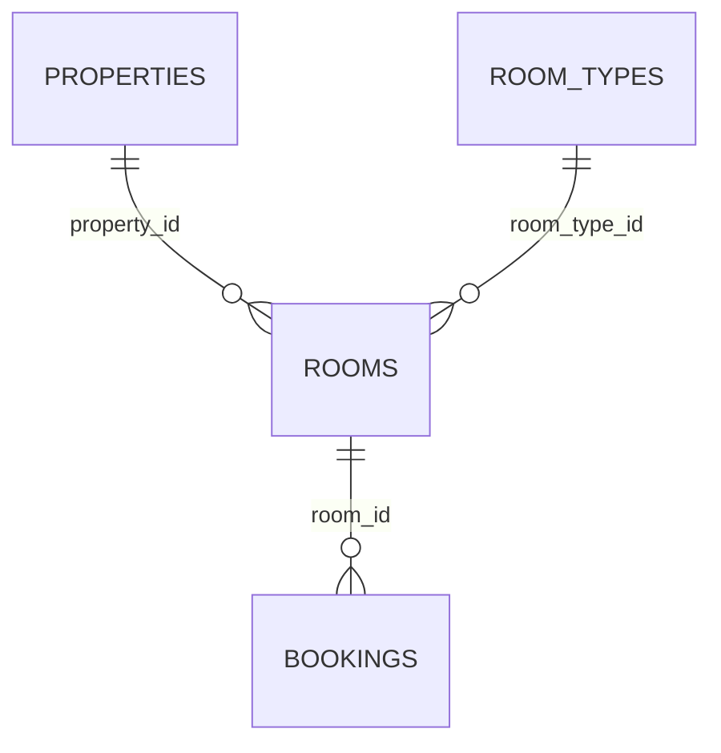

# hotel.rooms

A single physical room within a property. `status` is a genuine Postgres enum
(`hotel.room_status`), deliberately contrasted with `hotel.loyalty_tiers` (a lookup table doing
the same conceptual job for guests). `features` is a plain `text[]`, deliberately parallel to
`hotel.property_amenities` — the same kind of fact ("what does this thing offer") modeled two
different ways in the same schema.

## Columns

| Column | Type | Notes |
|---|---|---|
| `id` | `bigint` | Primary key, identity. |
| `property_id` | `bigint` | Not null, references `hotel.properties (id)`. |
| `room_type_id` | `bigint` | Not null, references `hotel.room_types (id)`. |
| `room_number` | `text` | Not null. Unique together with `property_id`. |
| `floor` | `smallint` | Nullable. |
| `status` | `hotel.room_status` (enum) | Not null, defaults to `'clean'`. One of `clean`/`dirty`/`maintenance`/`out_of_order`. |
| `features` | `text[]` | Not null, defaults to `'{}'`. |

## Notable functions

- `hotel.room_effective_rate(room)` — [computed field](../../query-language/computed-fields.md),
  a one-hop lookup of `base_price` through `room_type_id`.
- `hotel.concat_features(sep, variadic parts)` — a helper over `features`-shaped data;
  exercises `VARIADIC` argument-mode introspection, not itself tied to a specific room's data.
- `hotel.rooms_available(property_id, on_date default current_date)` — `SETOF hotel.rooms`,
  the rooms in a property not booked over a given date; exercises a default argument value.
