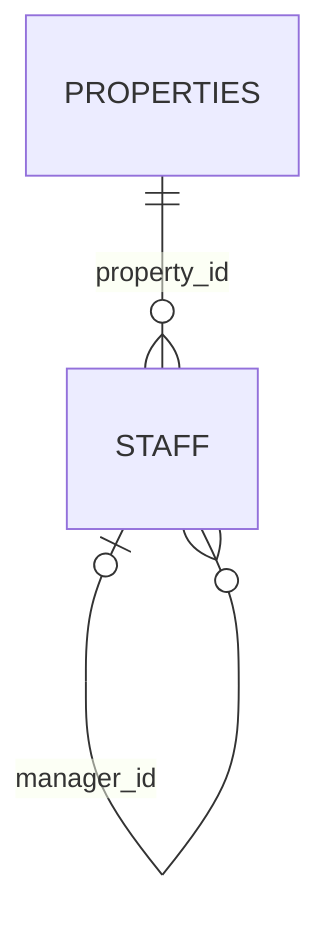

# hotel.staff

Property staff, self-referencing via `manager_id` — this schema's instance of the self-join
case worked through in [Shaping a query ## Aliases and self-joins](../../query-language/shaping.md#aliases-and-self-joins).
The seed data gives each property a three-level chain (GM → assistant manager → line staff)
specifically so that case has real rows to query against.

## Columns

| Column | Type | Notes |
|---|---|---|
| `id` | `bigint` | Primary key, identity. |
| `property_id` | `bigint` | Not null, references `hotel.properties (id)`. |
| `manager_id` | `bigint` | Nullable, references `hotel.staff (id)` — self-reference. |
| `name` | `text` | Not null. |
| `role` | `text` | Not null. |
