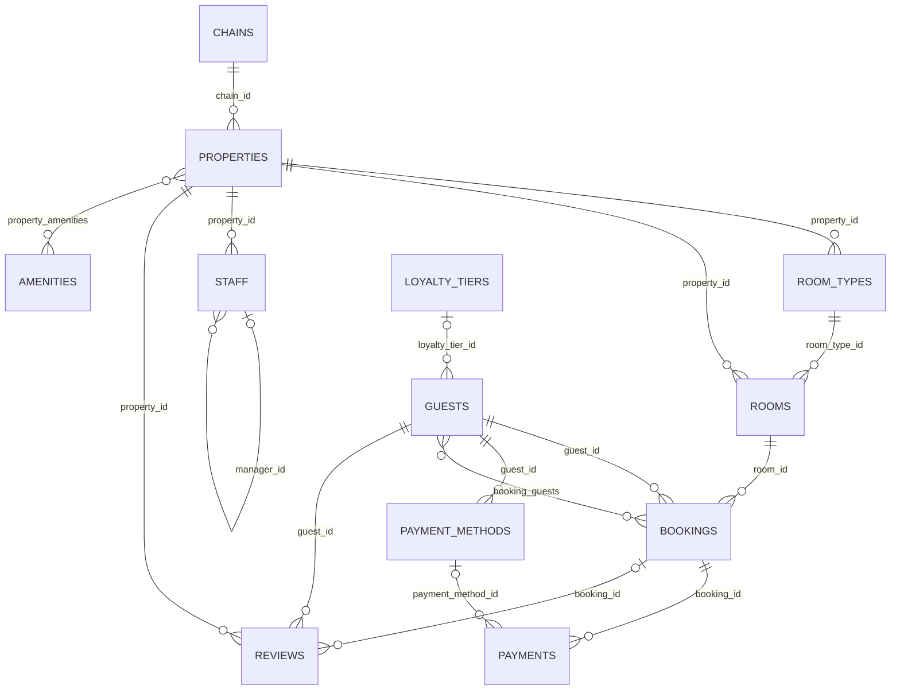

# Database reference

Every example in this section queries the same schema: a small hotel-booking database, deep
enough in relationships to show what joins, aggregates, and nested writes actually look like
against something more real than a couple of flat tables. It ships as this repo's own dev
fixture — `just db-fresh` brings it up locally (see [Getting started](../getting-started.md)).

An arrow into a table is the direction rel calls **incoming** when you join that way — the
child's own foreign key points back at the parent (`rooms.property_id → properties.id`), so it
comes back as an array. Reading a foreign key the other way — `properties.chain_id →
chains.id` — is **outgoing**: one object, not an array. See [Joining and embedding
relations](joining.md) for what that means for a query.

## Tables

| Table | Key | What it is |
|---|---|---|
| `hotel.chains` | `id` | A hotel group operating one or more properties under a shared brand. |
| `hotel.properties` | `id` | A single hotel property belonging to a chain. |
| `hotel.room_types` | `id` | A category of room offered by a property (e.g. Deluxe, Suite), with its own base price and capacity. |
| `hotel.rooms` | `id` | A single physical room within a property. |
| `hotel.staff` | `id` | Property staff; `manager_id` self-references another row in `hotel.staff`. |
| `hotel.amenities` | `id` | A catalog of amenities a property can offer (pool, gym, parking, ...). |
| `hotel.property_amenities` | `(property_id, amenity_id)` | Many-to-many: which amenities a property offers. |
| `hotel.loyalty_tiers` | `id` | Loyalty program tiers, looked up by name. |
| `hotel.guests` | `id` | A person who can book a room. |
| `hotel.bookings` | `id` (uuid) | A guest's reservation of a room for a period (`stay`, a `tstzrange`). |
| `hotel.booking_guests` | `(booking_id, guest_id)` | Many-to-many: every guest actually staying on a booking, beyond just the primary booker. |
| `hotel.payment_methods` | `id` | A guest's saved payment method — a non-reversible summary only (brand/last4/expiry), never a full card number. |
| `hotel.payments` | `id` (uuid) | A charge (or refund) against a booking. |
| `hotel.reviews` | `id` | A guest's review of a property, optionally tied to the specific booking it followed. |

A few columns worth knowing about because they show up in examples across this section:
`hotel.guests.billing_address` and `hotel.payment_methods.card` are composite-typed columns
(`hotel.address`, `hotel.card_summary`), not joins to another table — a guest only ever has one
current billing address. `hotel.rooms.features` is a plain `text[]`. `hotel.properties` and
`hotel.reviews` each carry a generated `tsvector` column for full-text search. Several tables
also expose computed columns — `hotel.booking_nights(booking)`,
`hotel.booking_total_paid(booking)`, `hotel.guest_full_name(guest)`,
`hotel.property_average_rating(property)` — ordinary Postgres functions taking the row type as
their argument, selectable via [`call`](aggregates.md).
